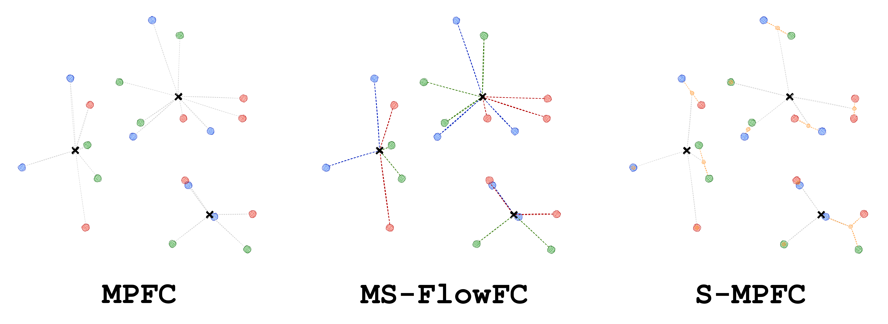
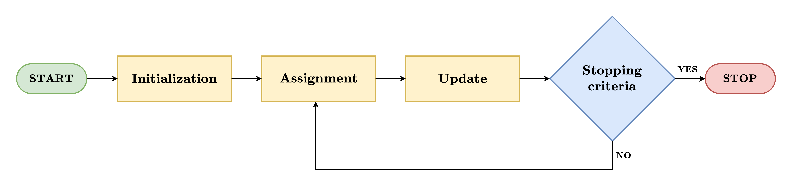

[](LICENSE)
[](https://arxiv.org/abs/2605.13759)

# Fast and effective algorithms for fair clustering at scale

<p align="center">
  
  <br>
</p>

This repository provides the implementation of three **heuristic algorithms for fair clustering** (MPFC, MS-FlowFC, and S-MPFC), along with two exact approaches (MIQCP and SetVars). Fair clustering is an unsupervised machine learning task that **partitions a dataset** into clusters of similar objects while ensuring an adequate **representation of protected groups** defined by sensitive features (e.g., age group, gender, or other categorical features) within each cluster.

All heuristic algorithms implemented here are based on the **k-means decomposition scheme**, which alternates between an **assignment step** and a **cluster center update step** until convergence, as illustrated in the figure that follows.

<p align="center">
  
</p>

MPFC solves the assignment step as a **binary linear program**, while MS-FlowFC solves a **sequence of minimum-cost flow problems**. S-MPFC builds on MPFC by adding a preprocessing step that **groups nearby objects into batches**. The representatives of these batches (their centers of gravity) form a reduced dataset, which is then clustered using a **modified binary linear program** for the assignment step and a **batch-weighted update step**. 

A key feature of these algorithms is the precise control they offer over the **trade-off between clustering cost and fairness** through a **single control parameter**, which makes the trade-off easy to navigate in practice. Each algorithm is recommended for different operational requirements, as summarized in the table below.

<div align="center">

| Algorithm  | Solver   | License-free* | Solution quality | Scalability | Recommended for                    |
|:-----------|:---------|:-------------:|:----------------:|:-----------:|:-----------------------------------|
| MPFC       | Gurobi   | No            | High             | Medium      | Highest solution quality (n ≤ 10⁵) |
| MS-FlowFC  | OR-Tools | Yes           | High             | High        | High quality at scale (n ≤ 10⁶)    |
| S-MPFC     | Gurobi   | No            | Medium           | Very high   | Maximum scalability (n > 10⁶)      |

</div>

*Gurobi offers [free academic licenses](https://www.gurobi.com/academia/academic-program-and-licenses/) but requires a paid license for commercial use. OR-Tools is distributed under the Apache 2.0 license and works out of the box after installation.

For a more detailed description of the algorithms, refer to the corresponding [paper](https://arxiv.org/abs/2605.13759).

## Quick start

You can use all algorithms by installing `fair-clustering-at-scale` as a package in your own project. Create a new environment (or use an existing one) and install the package with `uv`:

```bash
uv add git+https://github.com/claudio-mantuano/fair-clustering-at-scale.git
```

or with `pip`:

```bash
pip install git+https://github.com/claudio-mantuano/fair-clustering-at-scale.git --extra-index-url https://pip.hexaly.com
```

All required dependencies are installed automatically. You can then import the corresponding class and invoke the desired method.

<div align="center">

| Algorithm  | Module                  | Class                | Method        |
|:-----------|:------------------------|:---------------------|:--------------|
| MPFC       | `fair_clustering.blp`   | `BLPBasedHeuristic`  | `.mpfc()`     |
| MS-FlowFC  | `fair_clustering.flow`  | `FlowBasedHeuristic` | `.msflowfc()` |
| S-MPFC     | `fair_clustering.blp`   | `BLPBasedHeuristic`  | `.smpfc()`    |
| MIQCP      | `fair_clustering.exact` | `ExactApproaches`    | `.miqcp()`    |
| SetVars    | `fair_clustering.exact` | `ExactApproaches`    | `.setvars()`  |

</div>

> [!IMPORTANT]
> The methods `.mpfc()`, `.smpfc()`, `.miqcp()`, and `.setvars()` rely on commercial optimization solvers and require a valid license. Free academic licenses are available:
> - [Gurobi Academic License](https://www.gurobi.com/academia/academic-program-and-licenses/) (Gurobi 12 is the default for this project)
> - [Hexaly Academic License](https://www.hexaly.com/pricing) (Hexaly 14 is the default for this project)
> 
> If you already have a license, ensure that the versions of `gurobipy` and `hexaly` match the versions of the locally installed solvers. If they do not, upgrade or downgrade `gurobipy` and `hexaly` accordingly.

An example for MS-FlowFC, which does not require any license, is provided below. The parameters accepted by the constructor are documented in the docstring of the `FairClustering` base class in `fair_clustering/base.py`, together with the full list of available attributes.

```python
import numpy as np
from fair_clustering.flow import FlowBasedHeuristic

n_objects = 100_000
n_features = 10 
n_groups = 3  

np.random.seed(42)
X = np.random.rand(n_objects, n_features)
sensitive_feature = np.random.randint(0, n_groups, size=n_objects)

fc = FlowBasedHeuristic(
    X=X, sensitive_feature=sensitive_feature, tolerance=0.1, n_clusters=10
)
fc.msflowfc()

print(f"Cost: {fc.clustering_cost:.2f}")
print(f"Balance: {fc.clustering_balance:.2f}")
print(f"Runtime: {fc.runtime:.2f}s")
```

S-MPFC additionally requires three batch-related parameters (`batch_X`, `batch_map`, `batch_weights`), which can be constructed using the `create_batches` helper function from `fair_clustering.preprocessing`:

```python
from fair_clustering.blp import BLPBasedHeuristic
from fair_clustering.preprocessing import create_batches

batch_X, batch_map, batch_weights = create_batches(
    X, sensitive_feature, n_batches=500
)

fc = BLPBasedHeuristic(
    ...,  # same parameters as the example above
    batch_X=batch_X, batch_map=batch_map, batch_weights=batch_weights
)
fc.smpfc()
```

> [!NOTE]
> The implementation currently supports only datasets with a single sensitive feature.

## Run experiments

### Requirements

To run the experimental pipeline, you need **uv** (to manage Python and dependencies), **Gurobi** (to run MPFC, S-MPFC, and MIQCP), **Hexaly** (to run SetVars), and optionally **Git** (to clone the repository).

- **uv** 

    uv is a fast Python package and project manager that handles Python installation, virtual environment creation, and dependency management in a single tool. You can install it with one command.

    **Linux/macOS:**
    ```bash
    curl -LsSf https://astral.sh/uv/install.sh | sh
    ```

    **Windows (PowerShell):**
    ```powershell
    powershell -ExecutionPolicy ByPass -c "irm https://astral.sh/uv/install.ps1 | iex"
    ```

    For alternative installation methods, see the [uv installation docs](https://docs.astral.sh/uv/getting-started/installation/).

- **Gurobi and Hexaly** 

    Gurobi and Hexaly are commercial mathematical optimization solvers. Both require a license, but free academic licenses are available for [Gurobi](https://www.gurobi.com/academia/academic-program-and-licenses/) and [Hexaly](https://www.hexaly.com/pricing). By default, this project uses Gurobi 12 and Hexaly 14.

- **Git** 

    Git is required only to clone the repository (see the [official Git documentation](https://git-scm.com/doc) for installation instructions). Alternatively, you can download this repository as a ZIP file.

### Installation

1. **Clone or download repository**

    - Option A: Clone with Git

        Open your terminal, navigate to your desired location, and run:

        ```bash
        git clone https://github.com/claudio-mantuano/fair-clustering-at-scale.git
        cd fair-clustering-at-scale
        ```

    - Option B: Download as ZIP

        - Go to the [repository page](https://github.com/claudio-mantuano/fair-clustering-at-scale).
        - Click **Code** → **Download ZIP**.
        - Extract the ZIP archive to your desired location.
        - Open a terminal and navigate to the extracted folder.

2. **Set up the project with uv**

    From the repository root (`fair-clustering-at-scale/`), run:

    ```bash
    uv sync
    ```

    This command downloads Python, creates a virtual environment in `.venv/`, and installs all required dependencies.

> [!WARNING]
> The versions of `gurobipy` and `hexaly` must match the versions of the locally installed solvers. After running `uv sync`, you may need to upgrade or downgrade `gurobipy` and `hexaly` accordingly.

### Usage

You can use this project's experimental pipeline to reproduce the experiments described in our [paper](https://arxiv.org/abs/2605.13759) or to run experiments on your own dataset with custom settings.

- **Reproduce the paper's experiments**

    The implementation natively supports two synthetically generated datasets (`synthetic_a` and `synthetic_b`) and five datasets from the [UCI Machine Learning Repository](https://archive.ics.uci.edu/) ([creditcard](https://archive.ics.uci.edu/dataset/350/default+of+credit+card+clients), [bank](https://archive.ics.uci.edu/dataset/222/bank+marketing), [adult](https://archive.ics.uci.edu/dataset/2/adult), [diabetes](https://archive.ics.uci.edu/dataset/296/diabetes+130-us+hospitals+for+years+1999-2008), and [census1990](https://archive.ics.uci.edu/dataset/116/us+census+data+1990)). The synthetic datasets are located in `data/`, while the UCI datasets are downloaded automatically.

    To reproduce all experiments from the paper, run:

    ```bash
    uv run python main.py --config synthetic_a synthetic_b bank_5k creditcard bank_40k adult diabetes census1990
    ```

    Pass a subset of the names to run only the corresponding experiments. The results are stored in the `results/` folder.

> [!NOTE]
> The results for `bank_5k` and `census1990` in the paper use target balance values specified directly, to facilitate comparison with benchmark methods. The configs in `configs/` instead derive the target balance from the tolerance parameter, therefore results may differ from those in the paper. 

- **Run experiments on your own dataset with custom settings**

    - Place your dataset as a CSV file (e.g., `custom_dataset.csv`) in the `data/` folder.
    - Create a config file named `custom_dataset.py` in the `configs/` folder, defining the parameters listed in the table below.
    - Run the experiment:
        ```bash
        uv run python main.py --config custom_dataset
        ```

    The parameters that must be defined in the config file are described in the following table.

    | Parameter           | Type          | Description                                                           |
    |:--------------------|:--------------|:----------------------------------------------------------------------|
    | **Data**            |               |                                                                       |
    | `dataset`           | `str`         | Dataset file name (excluding the file extension)                      |
    | `sensitive_name`    | `str`         | Name of the sensitive feature                                         |
    | `binary`            | `bool`        | `True` to keep only the two largest protected groups                  |
    | `n_subsample`       | `int`         | Desired dataset size for stratified sampling                          |
    | `n_batches`         | `int`         | Number of batches (representatives) for S-MPFC                        |
    | `n_features`        | `int`         | Number of non-sensitive features to include                           |
    | `normalize`         | `bool`        | `True` to min-max scale non-sensitive features                        |
    | `standardize`       | `bool`        | `True` to standardize non-sensitive features                          |
    | **Algorithms**      |               |                                                                       |
    | `mpfc`              | `bool`        | `True` to run the MPFC heuristic (requires Gurobi)                    |
    | `msflowfc`          | `bool`        | `True` to run the MS-FlowFC heuristic                                 |
    | `smpfc`             | `bool`        | `True` to run the S-MPFC heuristic (requires Gurobi)                  |
    | `miqcp`             | `bool`        | `True` to run the MIQCP exact approach (requires Gurobi)              |
    | `setvars`           | `bool`        | `True` to run the SetVars exact approach (requires Hexaly)            |
    | **Experiments**     |               |                                                                       |
    | `n_clusters`        | `list[int]`   | Numbers of clusters to construct                                      |
    | `n_seeds`           | `int`         | Number of runs with different random seeds (only for heuristics)      |
    | `target`            | `str`         | Baseline for computing the target balance                             |
    | `tolerances`        | `list[float]` | Tolerance values controlling the cost-fairness trade-off              |
    | `global_time_limit` | `int`         | Time limit per instance (in seconds)                                  |
    | `plot`              | `bool`        | `True` to generate plots for two-dimensional datasets                 |

## Reference

If you use this software, please cite the following paper:

Mantuano, C., Kammermann, M., & Baumann, P. (2026). Fast and effective algorithms for fair clustering at scale. *arXiv preprint arXiv:2605.13759*. https://doi.org/10.48550/arXiv.2605.13759

```bibtex
@article{mantuano2026fast,
  title={Fast and effective algorithms for fair clustering at scale},
  author={Mantuano, Claudio and Kammermann, Manuel and Baumann, Philipp},
  journal={arXiv preprint arXiv:2605.13759},
  year={2026},
  doi={10.48550/arXiv.2605.13759}
}
```

## License

This project is licensed under the MIT License. See the [LICENSE](LICENSE) file for details.

## Contact information

For additional information related to this project, please contact Claudio Mantuano (`claudio.mantuano@unibe.ch`) or Philipp Baumann (`philipp.baumann@unibe.ch`).
